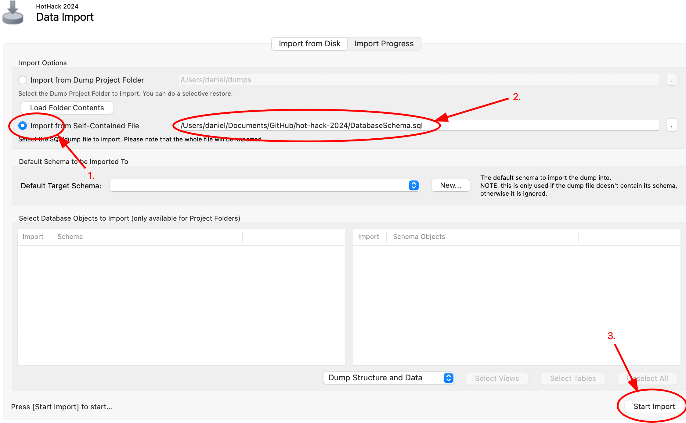
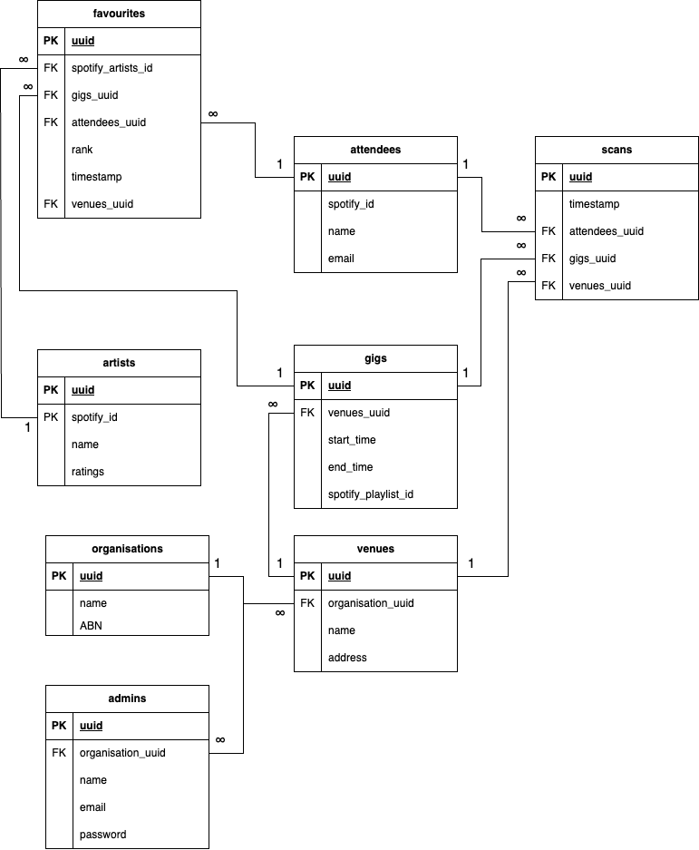

This is a [Next.js](https://nextjs.org/) project bootstrapped with [`create-next-app`](https://github.com/vercel/next.js/tree/canary/packages/create-next-app).

## Getting Started

First, run the development server:

```bash
npm run dev
# or
yarn dev
# or
pnpm dev
# or
bun dev
```

Open [http://localhost:3000](http://localhost:3000) with your browser to see the result.

You can start editing the page by modifying `app/page.tsx`. The page auto-updates as you edit the file.

This project uses [`next/font`](https://nextjs.org/docs/basic-features/font-optimization) to automatically optimize and load Inter, a custom Google Font.

## Database

This project uses a MySQL Database. To run the database on your local machine, follow the steps below.

1.  Ensure you have a MySQL server (https://dev.mysql.com/downloads/mysql/5.5.html?os=3&version=5) and MySQL Workbench (https://dev.mysql.com/downloads/workbench/) installed on your PC
2.  You can set the MySQL server be accessible with `user: root` and `password: password` on `localhost:3306` or your own preferred credentials (Set during the installation phase of the server software).
3.  Open MySQL Workbench and connect to the local database with the credentals set in the previous step.
4.  Import the 'DatabaseSchema.sql' file from this repository by going to 'Server' -> 'Data Import'. (NOTE: Import from self contained file in the import options) This step will create the database schema and populate some test data.
    
5.  Connect the application to your local database. Open the file `lib/db.ts` and change the config to:

```json
{
  "config": {
    "host": "localhost",
    "port": 3306,
    "database": "hot-hack-2024",
    "user": "root",
    "password": "password"
  }
}
```

### DAtabase Design



## Learn More

To learn more about Next.js, take a look at the following resources:

- [Next.js Documentation](https://nextjs.org/docs) - learn about Next.js features and API.
- [Learn Next.js](https://nextjs.org/learn) - an interactive Next.js tutorial.

You can check out [the Next.js GitHub repository](https://github.com/vercel/next.js/) - your feedback and contributions are welcome!

## Deploy on Vercel

The easiest way to deploy your Next.js app is to use the [Vercel Platform](https://vercel.com/new?utm_medium=default-template&filter=next.js&utm_source=create-next-app&utm_campaign=create-next-app-readme) from the creators of Next.js.

Check out our [Next.js deployment documentation](https://nextjs.org/docs/deployment) for more details.
